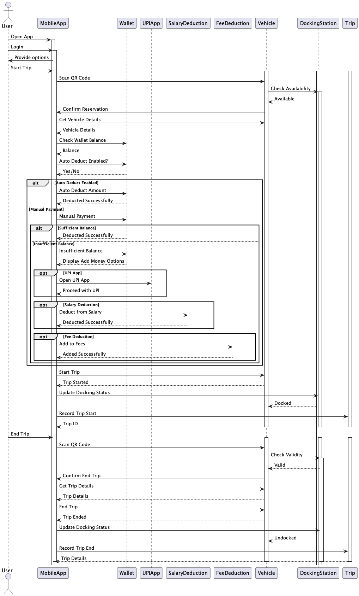
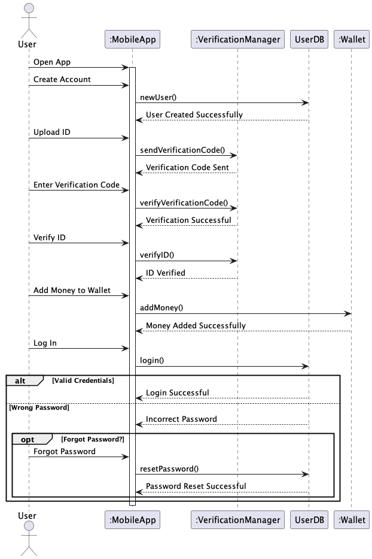
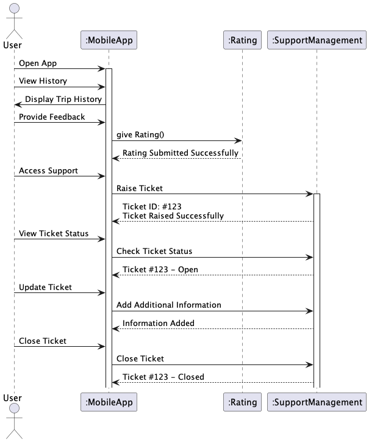

# Software Engineering - S24CS6.401
# Assignment - I
```
Gowlapalli Rohit
2021101113
```
# Smart vehicle booking system
## UML Class Diagram 


`Only the important attributes and methods are shown in the below description. Trivial getters and setters are not shown.`
### Description of the UML Class Diagram
>*  User
```
Represents the user of the system. Student , Teacher and Staff inherit from this class. Presuming that teachers do not necessitate special authentication.
```
#### Attributes
```
    - isVerified - to check if the user is verified or not
    - isWalletEnabled - to check if the user has enabled wallet or not
    - isAutoDeductEnabled - to check if the user has enabled auto-deduct or not
    - moneyDue - to check the money due for the user
    - currentVehicleID - the vehicleID of the vehicle the user is currently using
    - tripHistory - the list of trips the user has taken
    - transactionHistory - the list of transactions the user has made
```
#### Methods
```
    +verify() - method to verify the user
    +newUser() - method to create a new user
    +addMoney() - method to add money to the wallet
    +setPaymentMethod() - method to set default payment method
    +uploadVerificationID() - method to upload suitable verification ID
    +getTripHistory() - method to track usage history of the user
```
>* Student
```
Represents a student of IIITH
```
#### Attributes
```
    + rollNo - roll number of the student
    - deductFromFees - to check whether if money should be collected as student fee incase of insufficient balance
    - deductFromWallet - to check whether if money should be deducted from wallet 
```
>* Teacher 
```
Represents a teacher of IIITH
```
#### Attributes
```
    + teacherID - ID of the teacher
    - designation - designation of the teacher
    - deductFromSalary - to check whether if money should be deducted from salary incase of insufficient balance
    - deductFromWallet - to check whether if money should be deducted from wallet
```
>* Staff
```
Represents a staff member of IIITH
```
#### Attributes
```
    + staffID - ID of the staff member
    - designation - designation of the staff member
    - deductFromSalary - to check whether if money should be deducted from salary incase of insufficient balance
    - deductFromWallet - to check whether if money should be deducted from wallet
```
>* Vehicle
```
Represents a vehicle in the system. Bike , Moped and Bicycle inherit from this class. It is assumed that each vehicle has QRcode attached to it. Whenever a vehicle is reserved, it automatically transitions to an unavailable status. When a vehicle is returned, it becomes available again.
```
#### Attributes
```
    +vehicleID - License plate number of the vehicle
    -vehicleType - Bike , Moped or Bicycle
    + QRcode - QR code to reserve the vehicle
    # reservedAt - Time at which the vehicle was reserved
    # reservedBy - User who reserved the vehicle
    - isReserved - to check if the vehicle is reserved or not
    - Color - color of the vehicle
    - tyrePressure - tyre pressure of the vehicle
    - usageHistory - list of trips the vehicle has been used for
    
```
#### Methods
```
    +scanQRcode() - method to scan the QR code of the vehicle
    +reserveVehicle() - method to reserve the vehicle
    +returnVehicle() - method to return the vehicle
    +newVehicle() - method to create a new vehicle
```
>* Bike
```
Represents a bike in the system . It is assumed that bike has a fuel tank
```
#### Attributes
``` 
    - fuelStatus - fuel status of the bike in percentage
```
>* Moped
```
Represents a moped in the system . Moped is considered to be electric
```
#### Attributes
``` 
    - batteryPercentage - battery status of the moped in percentage
```
>* Bicycle
```
Represents a bicycle in the system . It is assumed that bicylce has a basket to carry luggage
```
#### Attributes
``` 
    + basketCapacity - capacity of the basket in kg
```
>* LocationTracker
```
Represents Interface for tracking the location of the vehicle
```
#### Methods
```
  + startTracking() - method to start tracking the location of the vehicle
  + stopTracking() - method to stop tracking the location of the vehicle
  + getCurrentLocation() - method to get the current location of the vehicle
  + setDestination(destination: String) - method to set the destination of the vehicle
  + getRoute() - method to get the route of the vehicle
  + displayMap() - method to display the map of the vehicle
```
>* DockingStation
```
Represents a docking station in the system. It is assumed that each docking station has a QRcode attached to it. Whenever a user submits a vehicle to a docking station, the vehicle ID gets included in the array of available vehicles at that docking station. When a vehicle is removed, the corresponding vehicle ID is also taken out from the docking station's array.
```
#### Attributes
```
    - stationLocation - location of the station
    - vehiclesDocked - list of vehicles docked at the station
    - stationUsageHistory - list of trips the station has been used for
    - VehicleLocations - list of vehicles and their locations
    - stationCapacity - capacity of the station
    - stationMaintenanceStatus - Maintenance status of the station
    - stationSecurityStatus - Security status of the station
```
#### Methods
```
    + dockVehicle() - method to dock a vehicle at the station
    + undockVehicle() - method to undock a vehicle from the station
    + newDockingStation() - method to create a new docking station
    + updateVehicleLocatiodatan(VehicleID: String, location: String) - method to update the location of the vehicle
    + updateVehicleStatus(VehicleID: String, status: String) - method to update the status of the vehicle
    + logData(data: String): - method to log 
```
>* Transaction
```
Represents a transaction in the system . The payment is determined by the trip class, taking into account the type of vehicle used and the duration of the trip. This process involves updating the user's wallet balance and providing a means for the user to add funds to their wallet.
```
#### Attributes
```
    - transactionDate - Date of the transaction
    - transactionAmount - Amount of the transaction
    - transactionType - Type of the transaction
    - transactionStatus - Status of the transaction
    - transactionRemarks - Remarks of the transaction
    - transactionBy - User who made the transaction
    - transactionFor - Vehicle for which the transaction was made
```
#### Methods
```
    + makeTransaction() - method to make a transaction
    + updateWallet() - method to update the wallet
```
>* Trip
```
Represents a trip in the system . This class is responsible for recording both the starting and ending times of a vehicle. Utilizing the journey duration, it computes the expenses associated with the trip. Additionally, it imposes penalties according to specified rules, such as failing to return the vehicle within the allotted time. Following the computation of the overall bill, it facilitates the payment process through the "make payment" option.
```
#### Attributes
```
    - tripStart - Start time of the trip
    - tripEnd - End time of the trip
    - tripStartLocation - DockingStation from which the trip started
    - tripEndLocation - DockingStation at which the trip ended
    - tripDistance - Distance of the trip
    - tripAmount - Amount of the trip
    - tripTransaction  - Transaction of the trip
    - tripStatus - Status of the trip
    - tripRemarks - Remarks associated with the trip
    - tripByUserID - UserID of the user who took the trip
    - tripForVehicleID - VehicleID of the vehicle for which the trip was taken
    - tripFine - Fine associated with the trip
    - Rating - Rating of the trip
```
#### Methods
```
    + newTrip() - method to create a new trip
    + updateTrip() - method to update the trip
    + deleteTrip() - method to cancel the trip
    + startTrip() - method to start the trip
    + endTrip() - method to end the trip
    + calculateTripAmount() - method to calculate the amount of the trip
    + updateVehicle() - method to update the vehicle associated with the trip
```
>* Rating 
```
Represents a rating in the system .
```
#### Attributes
```
    - Stars - Stars associated with the rating
    - Feedback - Feedback associated with the rating
```
#### Methods
```
    + giveRating() - method to give rating
    + giveFeedback() - method to give feedback
```
>* SupportManagement
```
Represents a support management in the system . 
```
#### Attributes
```
    + ticketID - ID of the ticket
    - description - Description of the ticket
    - tags - Tags associated with the ticket
    - assignedTo - Technician to whom the ticket is assigned
    - raisedByUserID - UserID of the user who raised the ticket
```
#### Methods
```
    - raiseTicket() - method to raise a ticket
    - closeIssue() - method to close the ticket
    - submitFeedback() - method to submit feedback
    - updateTicket() - method to update the ticket
```
>* Wallet 
```
Represents a wallet in the system . 
```
#### Attributes
```
    + walletID - ID of the wallet
    - walletUserID - UserID of the user who owns the wallet
    - walletBalance - Balance of the wallet
    - walletTransactions - Transactions associated with the wallet
```
#### Methods
```
    + addMoney() - method to add money to the wallet
    + deductMoney() - method to deduct money from the wallet
```
>* UPIApp
```
Represents UPI Interface in the system . 
```
#### Methods
```
  + openUPIApp() - method to open the UPI app
  + proceedWithUPI() - method to pay with UPI
```
>* MobileApp
```
Represents Mobile App in the system . 
```
#### Attributes
```
  - appVersion - version of the app
  - deviceOS - OS of the device
```
#### Methods
```
  + login() -  method to login to the app
  + logout() - method to logout of the app
  + register() - method to register to the app
  + openMobileApp() - method to open the mobile app
  + proceedWithMobileApp() - method to pay with mobile app
  + payWithWallet() - method to pay with wallet
  + showDocumentations() - method to show documentations
  + updateProfile() - method to update profile
  + displayFAQs() - method to display FAQs
  + viewNotifications() - method to view notifications
  + accessSupport() - method to access support
  + checkInbox() - method to check inbox
  + setPreferences() - method to set preferences
  + planRoute(destination: String) - method to plan route
  + viewPromotions() - method to view promotions
  + shareTripDetails() - method to share trip details
  + rateApp() - method to rate the app
  + toggleNotifications(enable: boolean) - method to toggle notifications
  + viewHistory() - method to view history
  + inviteFriends() - method to invite friends
  + redeemRewards() -  method to redeem rewards
  + reportIssue() - method to report an issue
```
>* VerificationManager
```
Represents Verification Manager in the system . It assists in verifying the user 
```
#### Methods
```
    + verifyUser() - method to verify the user
    + sendVerificationCode() - method to send verification code
    + verifyVerificationCode() - method to verify verification code
    + verifyID() - method to verify ID
```
>* SalaryDeduction
```
Represents interface for salary deduction in the system . 
```
#### Methods
```
  + deductFromSalary() - method to deduct from salary
```
>* FeeDeduction
```
Represents interface for fee deduction in the system . 
```
#### Methods
```
  + addToFees() - method to add due money to fee
```

#### Relationships in the UML Class Diagram
1. **User "1" -- "0..*" Trip : Goes On >**
   - *Relationship Type:* Association
   - *Cardinality:* One user can go on  multiple trips (0 or more).
   - *Description:* Each user can have zero or more trips, and a trip is associated with exactly one user.

2. **Trip "0..*" o-- "1..*" DockingStation : Starts/Ends At**
   - *Relationship Type:* Aggregation 
   - *Cardinality:* One trip starts and ends at one docking station; one docking station can be the start and end for multiple trips.
   - *Description:* A trip has a starting and ending docking station, and a docking station can be associated with multiple trips.

3. **Vehicle "1" -- "0..*" Trip : Used In >**
   - *Relationship Type:* Association
   - *Cardinality:* One vehicle can be used in multiple trips (0 or more).
   - *Description:* Each vehicle can be used in zero or more trips, and a trip is associated with exactly one vehicle.

4. **Trip "1" o-- "1" Transaction : Associated With >**
   - *Relationship Type:* Aggregation 
   - *Cardinality:* One trip is associated with exactly one transaction, and one transaction is associated with exactly one trip.
   - *Description:* A trip is associated with a transaction, indicating the financial aspect of the trip.

5. **User "1" -- "0..*" Transaction : Makes >**
   - *Relationship Type:* Association
   - *Cardinality:* One user can make multiple transactions (0 or more).
   - *Description:* Each user can make zero or more transactions, and a transaction is associated with exactly one user.

6. **DockingStation "0..*" o-- "0..*" Vehicle : Contains**
   - *Relationship Type:* Aggregation
   - *Cardinality:* A docking station can contain zero or more vehicles, and a vehicle can be contained in zero or more docking stations.
   - *Description:* A docking station can have multiple vehicles, and a vehicle may be present in multiple docking stations.

7. **User "1" -- "1" Wallet : Owns >**
   - *Relationship Type:* Association
   - *Cardinality:* One user owns exactly one wallet, and one wallet is owned by exactly one user.
   - *Description:* Each user owns a single wallet, representing the financial account associated with that user.

8. **Trip "1" *-- "0..1" Rating : has**
   - *Relationship Type:* Composition
   - *Cardinality:* One trip has zero or one ratings, and one rating is associated with exactly one trip.
   - *Description:* Each trip can have zero or one associated ratings, and a rating is linked to exactly one trip.

9. **User "1" -- "0..*" SupportManagement : Raises**
   - *Relationship Type:* Association
   - *Cardinality:* One user can raise zero or more support tickets, and each support ticket is raised by exactly one user.
   - *Description:* A user can raise zero or more support tickets for assistance.

10. **User "0..*" -- "0..*" MobileApp : Uses**
    - *Relationship Type:* Association
    - *Cardinality:* Users (0 or more) can use zero or more mobile apps.
    - *Description:* Users may use zero or more mobile apps, and a mobile app can be used by multiple users.

11. **Wallet "1" *-- "0..*" Transaction : Initiates**
    - *Relationship Type:* Composition
    - *Cardinality:* One wallet initiates zero or more transactions.
    - *Description:* Each wallet can initiate zero or more transactions, and a transaction is associated with exactly one wallet.

12. **User "0..*" -- "0..*" Vehicle : Rides >**
    - *Relationship Type:* Association
    - *Cardinality:* Users (0 or more) can ride zero or more vehicles.
    - *Description:* Users may ride zero or more vehicles, and a vehicle can be ridden by multiple users.

13. **User "0..*" -- "0..*" DockingStation : Visits >**
    - *Relationship Type:* Association
    - *Cardinality:* Users (0 or more) can visit zero or more docking stations.
    - *Description:* Users may visit zero or more docking stations, and a docking station may be visited by multiple users.

14. **User "1" -- "0..*" Rating : Gives >**
    - *Relationship Type:* Association
    - *Cardinality:* One user can give zero or more ratings.
    - *Description:* A user can give zero or more ratings for various entities.

15. **VerificationManager "1" -- "0..*" User : Verifies >**
    - *Relationship Type:* Association
    - *Cardinality:* One verification manager verifies zero or more users.
    - *Description:* A verification manager verifies the identity of zero or more users.
  
16. **User <|-- Student**
    - *Relationship Type:* Generalization / Inheritance
    - *Description:* A student is a type of user.

17. **User <|-- Teacher**
    - *Relationship Type:* Generalization / Inheritance
    - *Description:* A teacher is a type of user.
  
18. **User <|-- Staff**
    - *Relationship Type:* Generalization / Inheritance
    - *Description:* A staff member is a type of user.

19. **Vehicle <|-- Bike**
    - *Relationship Type:* Generalization / Inheritance
    - *Description:* A bike is a type of vehicle.
  
20. **Vehicle <|-- Moped**
    - *Relationship Type:* Generalization / Inheritance
    - *Description:* A moped is a type of vehicle.

21. **Vehicle <|-- Bicycle**
    - *Relationship Type:* Generalization / Inheritance
    - *Description:* A bicycle is a type of vehicle.

22. **Wallet ..|> UPIApp**
    - *Relationship Type:* Realization / Implementation
    - *Description:* A wallet is realized by a UPI app.

23. **Wallet ..|> SalaryDeduction**
    - *Relationship Type:* Realization / Implementation
    - *Description:* A wallet is realized by salary deduction.
  
24. **Wallet ..|> FeeDeduction**
    - *Relationship Type:* Realization / Implementation
    - *Description:* A wallet is realized by fee deduction.

25. **MobileApp ..|> LocationTracker**
    - *Relationship Type:* Realization / Implementation
    - *Description:* A mobile app is realized by location tracking.

26. **DockingStation ..|> LocationTracker**
    - *Relationship Type:* Realization / Implementation
    - *Description:* A docking station is realized by location tracking.


#### Additional Assumptions
1. Payment
```
The payment is such that for the first x kilometers, a base rate of y rupees is taken. After that, it is at z rupees per 100 meters. The user books a vehicle using the application. Keep track of the current vehicle, money due, user details, etc. If a bike is not returned to the docking station within 8 hours and the bike is not renewed, a fine of 50 rupees is deducted every day. It is assumed that trip class calculates tripAmount and tripFine based on the tripDuration as stated above via the method calculateTripAmount() 
```
2. Wallet
```
The wallet implements UPIApp , SalaryDeduction and FeeDeduction Mechanisms to facilitate payment process. It is assumed that the wallet class updates the walletBalance and walletTransactions via the method updateWallet() 
```
3. Vehicle
```
It is assumed that via the MobileApp , the user can scan the QR code of the vehicle to reserve it. It is assumed that the vehicle class updates the vehicleStatus and vehicleLocation via the method updateVehicle() 
```


## UML Sequence Diagram for TripPayment


The sequence diagram outlines the process of managing a trip, including starting and ending a trip, checking wallet balance, and handling payment options. The interaction involves several actors such as User, MobileApp, Vehicle, DockingStation, Trip, Wallet, UPIApp, SalaryDeduction, and FeeDeduction.

1. **Open App and Login:**
   - User opens the mobile app and logs in.

2. **Start Trip:**
   - User selects the option to start a trip.
   - MobileApp initiates the trip by scanning the vehicle's QR code.
   - Vehicle and DockingStation are activated to check availability.
   - If available, the reservation is confirmed, and trip details are retrieved.
   - The trip is recorded, and the vehicle is marked as docked.

3. **End Trip:**
   - User chooses to end the trip.
   - MobileApp scans the vehicle's QR code again to confirm the end of the trip.
   - Vehicle and DockingStation are activated to check validity.
   - If valid, the trip details are retrieved, the trip is marked as ended, and the vehicle is undocked.

4. **Check Wallet Balance:**
   - MobileApp checks the user's wallet balance.

5. **Check Auto Deduct:**
   - MobileApp checks if auto deduction is enabled.

   - **Auto Deduction Enabled:**
     - If enabled, the specified amount is automatically deducted from the wallet.

   - **Manual Payment:**
     - If not enabled, the user chooses manual payment.
     
     - **Sufficient Balance:**
       - If the balance is sufficient, the amount is deducted.
       
     - **Insufficient Balance:**
       - If the balance is insufficient, the user is prompted with options:
         
         - UPI App: Open UPI App for payment.
         - Salary Deduction: Deduct from user's salary.
         - Fee Deduction: Add the payment to user's fees.

6. **Payment Handling:**
   - The payment options are processed, and the corresponding deductions or additions are made to the wallet.

7. **Deactivation:**
   - Wallet and MobileApp are deactivated.

This sequence illustrates the flow of events during a trip, including the initiation, completion, and payment processes, along with various payment options and deductions.


## UML Sequence Diagram for User Onboarding


The sequence diagram illustrates the interaction between a user and various components such as the mobile app, verification manager, user database (UserDB), and wallet. The sequence of events is as follows:

1. **Open App:**
   - User opens the mobile app.

2. **Create Account:**
   - User creates an account.
   - MobileApp sends a request to UserDB to create a new user.
   - UserDB confirms the successful creation of the user.

3. **Upload ID:**
   - User uploads identification.
   - MobileApp sends a verification code request to VerificationManager.
   - VerificationManager sends a verification code to MobileApp.

4. **Enter Verification Code:**
   - User enters the received verification code.
   - MobileApp verifies the code with VerificationManager.
   - VerificationManager confirms successful verification.

5. **Verify ID:**
   - User verifies their identification.
   - MobileApp requests ID verification from VerificationManager.
   - VerificationManager confirms the successful ID verification.

6. **Add Money to Wallet:**
   - User adds money to their wallet.
   - MobileApp sends a request to Wallet to add money.
   - Wallet acknowledges successful addition of money.

7. **Log In:**
   - User logs in.
   - MobileApp sends a login request to UserDB.
   
   - **Validation:**
     - If credentials are valid, UserDB confirms a successful login.
     - If the password is incorrect, UserDB notifies the MobileApp. 
     
       - **Forgot Password:**
         - If the user forgot the password, they can initiate a password reset.
         - MobileApp sends a request to UserDB to reset the password.
         - UserDB confirms a successful password reset.

8. **Deactivation:**
   - The MobileApp is deactivated.

This sequence demonstrates the user's journey, including account creation, ID verification, wallet management, and login procedures with additional consideration for password reset.

## UML Sequence Diagram for Support Management


This sequence diagram illustrates the interactions between a User, the MobileApp, the Rating component, the SupportManagement system, and the Documentation module. It outlines the processes of providing feedback, raising a support ticket, and accessing documentation through the mobile app.
## Steps
### Opening the Mobile App
1. **User** opens the mobile app.

### Viewing Trip History
2. **User** requests to view trip history.
3. **MobileApp** retrieves and displays trip history for the user.

### Providing Feedback
4. **User** decides to provide feedback.
5. **MobileApp** facilitates the process by interacting with the **Rating** component.
6. **Rating** receives feedback and submits the rating.
7. Feedback status is returned to **MobileApp**.

### Accessing Support
8. **User** chooses to access support within the app.
9. **MobileApp** initiates the process of raising a support ticket.
10. **SupportManagement** is activated, assigns a unique ticket ID (#123), and acknowledges the successful creation of the ticket.
11. **User** checks the status of the ticket.
12. **MobileApp** queries **SupportManagement** for the ticket status, and the system responds with the ticket being open (#123 - Open).

### Updating and Closing the Ticket
13. **User** decides to update the ticket with additional information.
14. **MobileApp** sends the updated information to **SupportManagement**.
15. **SupportManagement** processes the information and informs **MobileApp** about the successful addition.
16. **User** closes the support ticket.
17. **MobileApp** requests **SupportManagement** to close the ticket, and the system acknowledges the closure (Ticket #123 - Closed).

This sequence diagram outlines the seamless flow of actions for a user interacting with the mobile app, from providing feedback and accessing support to viewing trip history and accessing documentation.